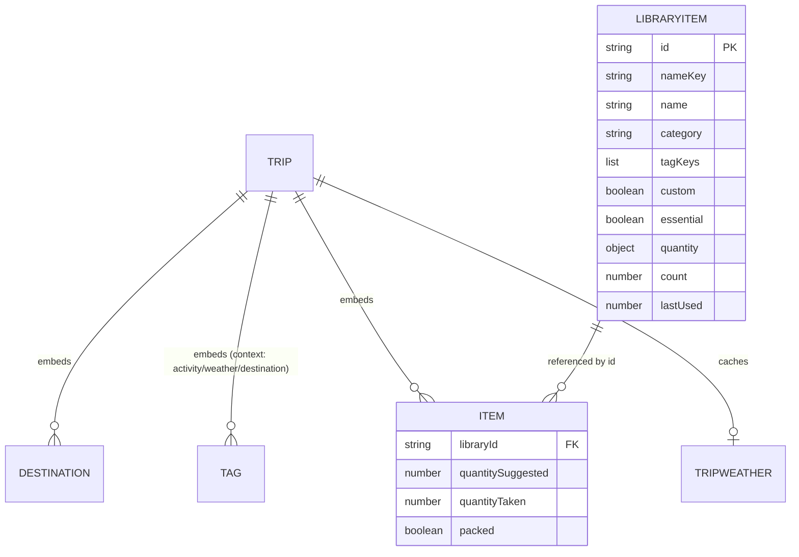
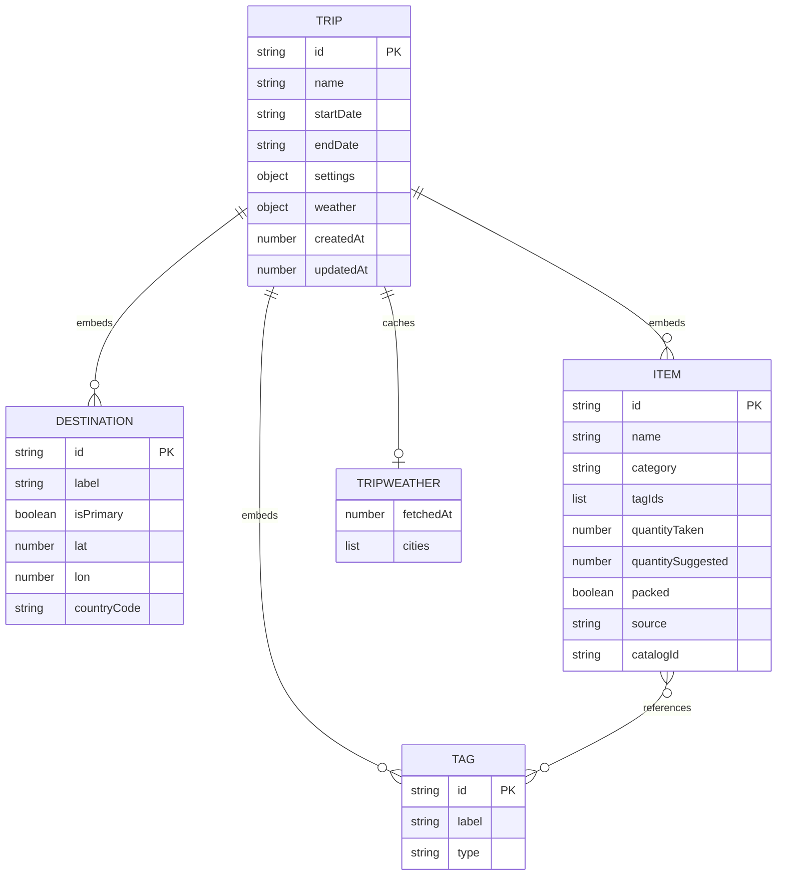
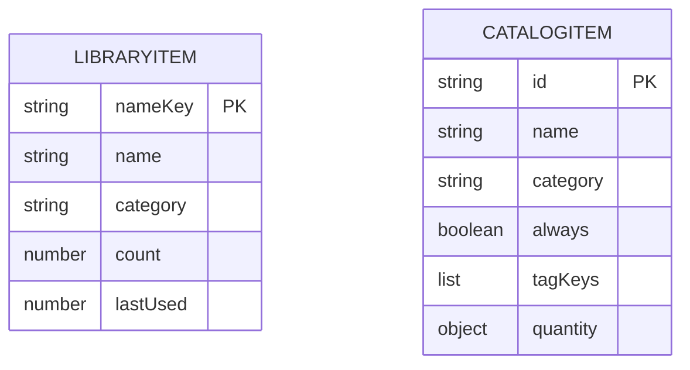
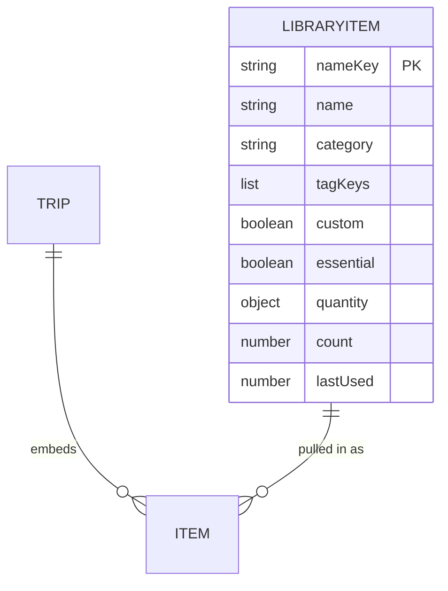
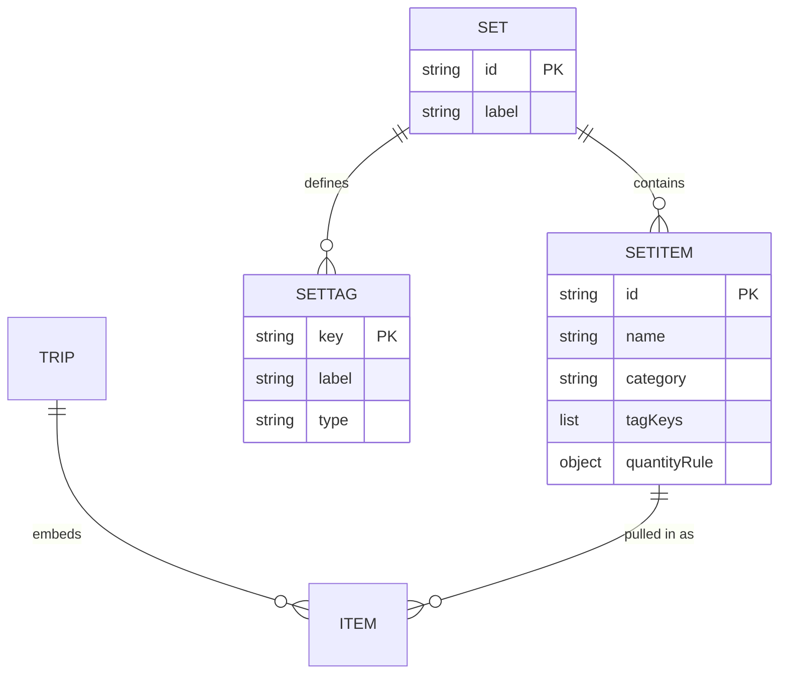

# Data Model

## Current (as built) — library is the single source of truth

**Persistence is one JSON document** in `localStorage` (key `packing-checklist`),
owned by `src/db/store.ts` (synchronous in-memory copy + `useAppData` via
`useSyncExternalStore`). No IndexedDB/Dexie anywhere — migrations are pure object
transforms (`migrate` in `src/db/appData.ts`), not schema upgrades. Shape
(`schemaVersion` 3):

```ts
{
  schemaVersion: number;
  trips: Trip[];
  library: LibraryItem[];        // items carry an optional `weight` (grams)
  removedDefaultIds: string[];   // tombstoned built-in items (deleted/edited)
  tagMeta: TagMeta[];            // per-tag group + trip-page "default" flag
  removedTagKeys: string[];      // tombstoned built-in tags
  customCategories: string[];    // user/imported categories (may have no items)
  removedCategories: string[];   // tombstoned built-in categories
}
```

Tags and categories are editable registries (`src/db/tags.ts`,
`src/db/categories.ts`); rename/delete are global and rewrite every referencing
item and trip so associations never drift.

A trip's `Item` is a thin **reference** into the `library` plus per-trip state
(`quantityTaken`, `quantitySuggested`, `packed`). Display fields (name/category/
tagKeys) are joined at render via `resolveItems`. Editing an item edits the library
row, so the change shows on every trip that references it. **Identity is the `id`:**
defaults get a deterministic `d:<catalogId>` (same on every install — see
`defaultId`); customs get a collision-resistant `c:<random>` (see `customId`).
`nameKey` is only a convenience for the typed-add "reuse same-named row" path and
search; two items may share a name, so a rename is an in-place field update.



- **No migration path / no legacy code.** The store starts from `emptyData()` and
  `seedLibrary()`; `migrate()` only tolerates missing/garbage fields. There is no
  import of any prior storage format (the one-time Dexie/IndexedDB reader was
  removed) and no v1 file compatibility — imports require the current envelopes.
- **Trip export** bundles the trip's referenced library rows (envelope v2) so a file
  stays portable; **`parseImport`/`parseAllTrips`** require that envelope. **Library
  export/import** (header ⋯ menu) round-trips the whole library, with **Merge**
  (per-conflict mine/theirs/both) or **Replace all** modes. Trip import **dedups by
  id** — present ids are reused, an id clash with a different item mints a fresh id.
  The typed-add path still reuses a same-named row to avoid accidental forks.

### Reference integrity: "Replace all" library import orphans trip items (future consideration)

Because trips reference library items **by `id`** and join display fields at
render, the reference is only valid while that `id` exists in `library`.
`replaceLibrary` (the **Replace all** import mode) swaps `data.library` wholesale
and does **not** touch `data.trips`. So if the imported library shares no ids with
the current one, every existing trip's `item.libraryId` becomes unresolvable:
`resolveItems` returns `{ name: '(removed item)', missing: true }` and the trip's
list renders entirely as missing rows. The trip is **not** emptied —
`trip.items.length` is unchanged and the references remain — but nothing resolves,
so it's functionally a broken list. (Merge mode avoids this: existing items are
kept, and **theirs** overwrites in place keeping the existing id, so refs survive.)
The import dialog warns, but the data layer does nothing to preserve references.

Options if this becomes a real problem:
- **Remap by name on replace** — rewire each trip reference to a same-named item in
  the new library where one exists; only genuinely-absent items go missing.
- **Stronger confirm** — count items that would be orphaned across N trips and
  require explicit confirmation before wiping.
- **Prune-missing affordance** — a one-click "remove missing items" on a trip
  (the UI already distinguishes them via `missing`).

## Previous (pre-reference)



Global stores / constants, not linked to a Trip by reference:



**Stores (Dexie):** `trips` (whole Trip aggregate per row) and `library`
(global custom items). `CATALOG` and `CATEGORIES` are static code constants.

### Key facts / pain points
- **Tags are per-trip** (embedded in `Trip`); there is no global tag taxonomy to
  edit centrally — each trip re-creates its own.
- **Categories are a fixed enum** (`CATEGORIES` in `types.ts`), not data.
- The reusable "set" today is split in two: the built-in **`CATALOG`** (static,
  drives suggestions) and the **`library`** (auto-saved custom items). They don't
  share a shape, and custom items save *automatically*, not on request.
- `packed` lives on the item but only matters when packing; the editor currently
  mixes planning (add/edit) and packing (check off) in one view.

## Agreed redesign — unified item library (2026-06-21)

One editable items store is the single source of truth; built-in defaults are
**seeded** into it (flagged `custom:false`), customs are `custom:true`. Suggestions
read from this store. Categories stay the fixed 8. Per-tag weights are dropped
(rank by match count); `quantity` + `essential` are kept so smart quantities and
essentials survive. Full library export/import becomes possible.



- DB v3: `library` rows gain `custom` (existing → true); built-ins seeded at
  runtime (idempotent by `nameKey`). The static `CATALOG` becomes the seed source
  only; `suggest.ts` reads the `library` store.

## Earlier draft (superseded)

**A. Two tabs on the trip page** — `Plan` (build/edit the list, no checkboxes)
and `Checklist` / view mode (check items off + progress). No model change;
`packed` stays on `Item`.

**B. Managed "set"** — a curated, reusable collection of items (and tags, maybe
categories), with *opt-in* saving when you add a custom item while planning.
Exact shape depends on the open questions below.


